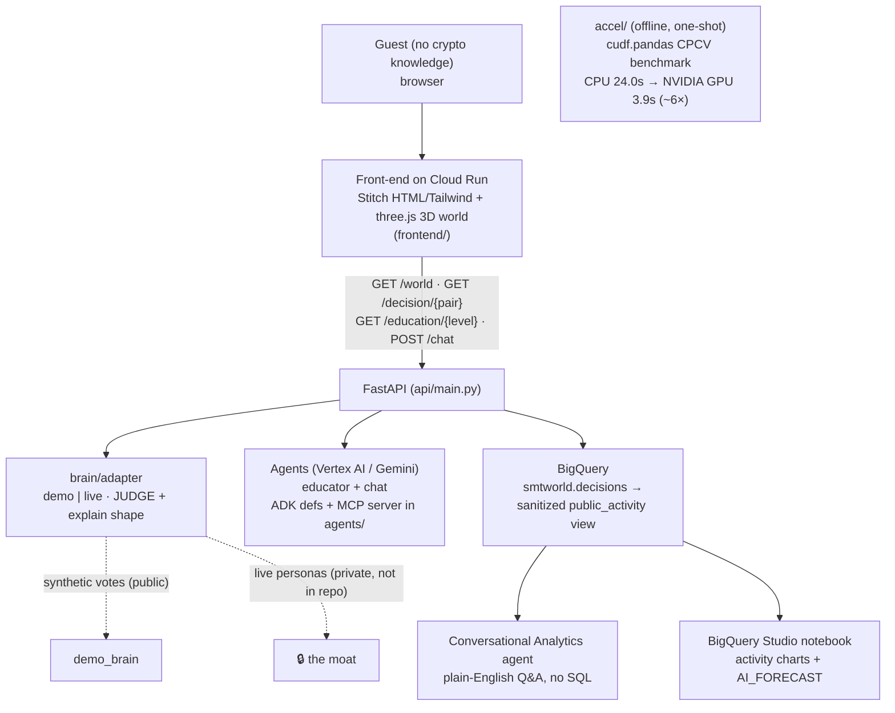
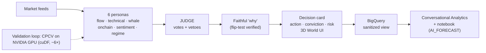

# Architecture — SMT World

## Process flow (data → decision → insight)

## Request flow
1. **`/world`** → `brain/adapter.world()` → all-8-pairs decision snapshot → three.js nodes,
   colored by action, sized by conviction; every call also lands sanitized rows in BigQuery.
2. **`/decision/{pair}`** → one decision dict (`action / conf / why / drivers / votes / risk`).
3. **`/education/{level}`** → `agents/educator_agent.rung()` → curated corpus lesson.
4. **`/chat`** → `agents/smt_chat_agent.answer()` → corpus context + current reads → Gemini
   (Vertex AI), graceful fallback to corpus when unconfigured.

## Academy-track reuse
- **Track 1** (ADK): agent definitions in `agents/`, served on Cloud Run.
- **Track 2** (MCP + BigQuery): `agents/mcp_server.py` exposes the sanitized brain as tools.
- **Cohort 2** (BigQuery conversational analytics + BQML): the Conversational Analytics agent +
  `AI_FORECAST` notebook over `public_activity`.
- **Track 3** (AlloyDB pgvector RAG): included in `agents/rag/` as an optional path, disabled for
  cost — Conversational Analytics covers the ask-the-data job.

## Moat boundary
The switch between `demo` and `live` in `brain/adapter.py` is the whole game: public = synthetic
votes in the real contract; private = live personas behind auth. See `MOAT.md`.
