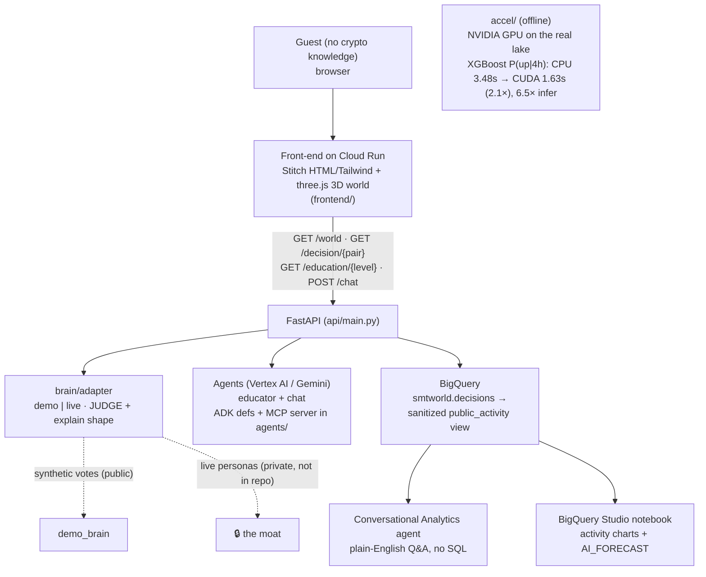
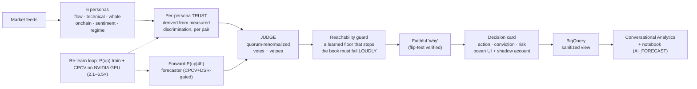
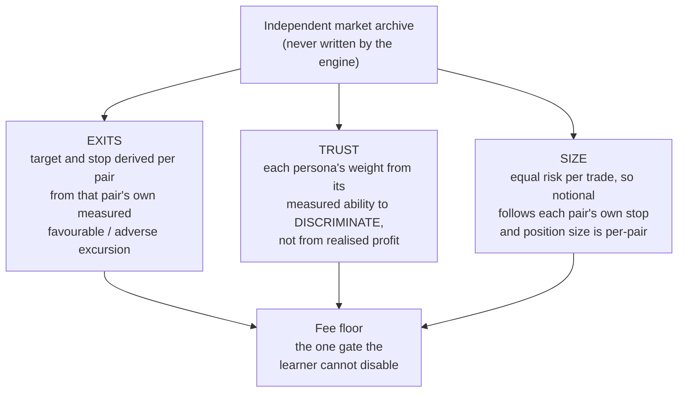

# Architecture — SMT World

```mermaid
flowchart TB
    G["Guest (no crypto knowledge)<br/>browser"] --> FE["Front-end on Cloud Run<br/>Stitch HTML/Tailwind + three.js 3D world<br/>(frontend/)"]
    FE -->|"GET /world · GET /decision/{pair}<br/>GET /education/{level} · POST /chat"| API["FastAPI (api/main.py)"]

    API --> BRAIN["brain/adapter<br/>demo | live · JUDGE + explain shape"]
    API --> AGENTS["Agents (Vertex AI / Gemini)<br/>educator + chat<br/>ADK defs + MCP server in agents/"]
    API --> BQ["BigQuery<br/>smtworld.decisions →<br/>sanitized public_activity view"]

    BRAIN -. "synthetic votes (public)" .-> DEMO["demo_brain"]
    BRAIN -. "live personas (private, not in repo)" .-> MOAT["🔒 the moat"]

    BQ --> CA["Conversational Analytics agent<br/>plain-English Q&A, no SQL"]
    BQ --> NB["BigQuery Studio notebook<br/>activity charts + AI_FORECAST"]

    ACCEL["accel/ (offline)<br/>NVIDIA GPU on the real lake<br/>XGBoost P(up|4h): CPU 3.48s → CUDA 1.63s (2.1×), 6.5× infer"]
```

## Process flow (data → decision → insight)

```mermaid
flowchart LR
    F["Market feeds"] --> P["6 personas<br/>flow · technical · whale<br/>onchain · sentiment · regime"]
    P --> T["Per-persona TRUST<br/>derived from measured<br/>discrimination, per pair"]
    T --> J["JUDGE<br/>quorum-renormalized<br/>votes + vetoes"]
    FC["Forward P(up|4h)<br/>forecaster (CPCV+DSR-gated)"] --> J
    J --> G["Reachability guard<br/>a learned floor that stops<br/>the book must fail LOUDLY"]
    G --> W["Faithful 'why'<br/>(flip-test verified)"]
    W --> D["Decision card<br/>action · conviction · risk<br/>ocean UI + shadow account"]
    D --> B["BigQuery<br/>sanitized view"]
    B --> A["Conversational Analytics<br/>+ notebook (AI_FORECAST)"]
    V["Re-learn loop: P(up) train + CPCV on NVIDIA GPU (2.1–6.5×)"] -.-> FC
    V -.-> T
```

### Nothing static — how a threshold is chosen

The rule the whole engine is built on: **a number that decides something is measured, not
chosen.** Where a value genuinely cannot be derived it is registered, and a CI test fails
if an unregistered one appears on the decision path. Three places this shows up, all
shipped and all measured against an *independent* market archive rather than against the
engine's own history:

```mermaid
flowchart TB
    M["Independent market archive<br/>(never written by the engine)"] --> E1["EXITS<br/>target and stop derived per pair<br/>from that pair's own measured<br/>favourable / adverse excursion"]
    M --> E2["TRUST<br/>each persona's weight from its<br/>measured ability to DISCRIMINATE,<br/>not from realised profit"]
    M --> E3["SIZE<br/>equal risk per trade, so notional<br/>follows each pair's own stop<br/>and position size is per-pair"]
    E1 --> FL["Fee floor<br/>the one gate the<br/>learner cannot disable"]
    E2 --> FL
    E3 --> FL
```

Two results worth stating because they shaped the design rather than merely confirming it:

- **Grading the engine's own guesses can only ever measure the guesser.** Asking the
  archive directly — the engine removed from the question — reversed a conclusion that ten
  prior queries had agreed on. *Ask the market before concluding about the market.*
- **Ranked year by year, per-pair VOLATILITY is stable and per-pair EDGE is not.** So
  sizing is per-pair, but keyed on volatility, which holds out of sample, rather than on
  edge, which reshuffles almost completely between years. That is the difference between a
  per-pair number and a per-pair number that survives.

## Request flow
1. **`/world`** → `brain/adapter.world()` → all-8-pairs decision snapshot → three.js nodes,
   colored by action, sized by conviction; every call also lands sanitized rows in BigQuery.
2. **`/decision/{pair}`** → one decision dict (`action / conf / why / drivers / votes / risk`).
3. **`/education/{level}`** → `agents/educator_agent.rung()` → curated corpus lesson.
4. **`/chat`** → `agents/smt_chat_agent.answer()` → corpus context + current reads → Gemini
   (Vertex AI), graceful fallback to corpus when unconfigured.

## Academy-track reuse
- **Agents (ADK):** agent definitions in `agents/`, served on Cloud Run.
- **Tools (MCP + BigQuery):** `agents/mcp_server.py` exposes the sanitized brain as tools.
- **Analytics (BigQuery Conversational Analytics + BQML):** the Conversational Analytics agent +
  `AI_FORECAST` notebook over `public_activity`.
- **Retrieval (AlloyDB pgvector RAG):** included in `agents/rag/` as an optional path, disabled for
  cost — Conversational Analytics covers the ask-the-data job.

## Moat boundary
The switch between `demo` and `live` in `brain/adapter.py` is the whole game: public = synthetic
votes in the real contract; private = live personas behind auth. See `MOAT.md`.
